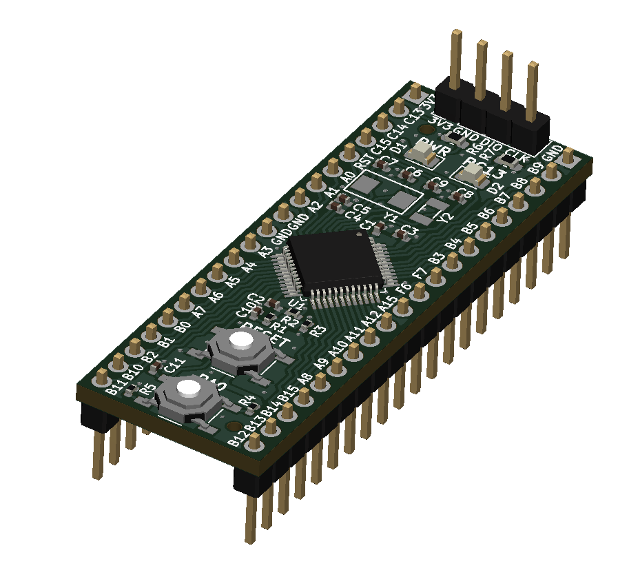
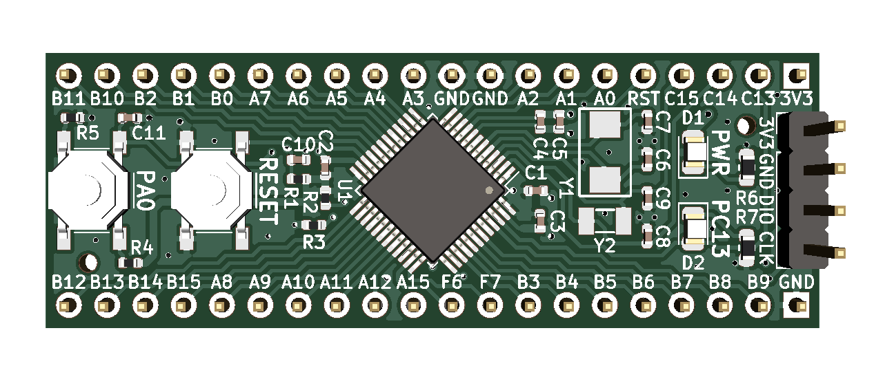
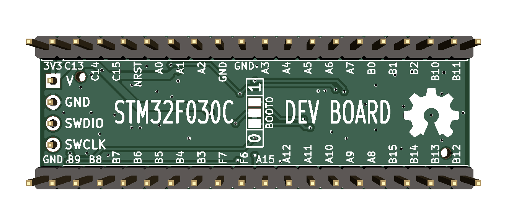

# stm32f0-devboard
 

A minimal development board featuring an STM32F030C8T6

## Description
This is a minimal development board for STM32F0xxC MCUs designed for ease of turnkey assembly by JLCPCB Co. Ltd. The board includes HSE and LSE oscillators, reset and user button, power and user LED, BOOT0 boot mode select solder jumper, and a SWD programming header. All components, sans connectors, can be assembled by JLCPCB, and tooling holes for the SMT assembly process are provided.

## Licensing
This project is released under the terms of the MIT License.
